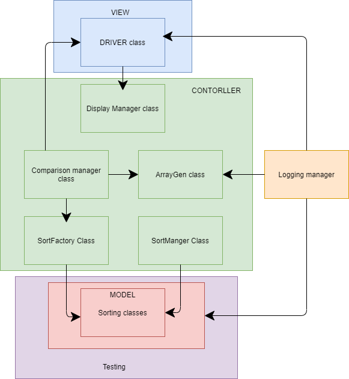

# Bahir Sorter App Project

<!-- TOC depthFrom:1 depthTo:6 withLinks:1 updateOnSave:1 orderedList:0 -->

* [Bahir Sorter Project](#bahir-sorter-project)
	* [Project Purpose](#project-purpose)
	* [Project Instructions](#project-instructions)
	* [How to use](#how-to-use)
    * [Block Diagram](block-diagram)
		* [Sort Manager plan](#sort-manager-plan)
			* [Driver class](#driver-class)
			* [ArrayGen class](#arraygen-class)
			* [Display Manager class](#display-manager-class)
			* [Comparison Manager class](#comparison-manager-class)
			* [Sort Factory class](#sort-factory-class)
			* [Sort Manager class](#sort-manager-class)
			* [Logging Manager class](#logging-manager-class)
		  * [Sorting classes](#sorting-classes)
			* [Testing classes](#testing-classes)
	* [Design process](#design-process)
      * [Agile](#agile)
      * [Retrospective](#retrospective)
		* [Main Java skills demonstrated (outside all the basics)](#main-java-skills-demonstrated-outside-all-the-basics)
			* [GIT REPO LINKS](#git-repo-links)

### Project Purpose
**To create a new project that will incorporate all the things we have learnt in Java in order to make a java sort application.**

### Project Instructions

- A user interface which allows the user to select a single sorting approach and a number of
random ints to sort.
- The following sort options, at least: Bubble sort, Merge sort, Quick sort, Insertion sort and
Selection sort, Binary Tree-based sorting.
- Java standard library sorting for comparison: Collections.sort(), Arrays.sort() and
Arrays.parallelSort().
- The user should be able to run several sort approaches, or all of them, with the same test
data.
- In all cases, execution time data should be provided using System.nanoTime() for timing.

## How to use

-Run the driver class and you should be prompted with a message telling you to input a number between 0-8 these numbers will indicated what sort to use.

-You will then be prompted to select the size of the array that you want

-then it will output the sorted array with some details

-You will then be prompted to if pick an sort to compare with that uses the array used before

-You can choose a new sort and it will end the program after or type 9 to Exit

#### Block Diagram

### Sort Manager plan

#### Driver class
- [x] User interface gets displayed
- [x] Minimal amount of code
- [x] Handles exceptions where needed
- [x] Takes user input

#### ArrayGen class
- [x] Generates a random array
- [x] Takes the user input of size of array
- [x] Returns the array of correct size

#### Display Manager class
- [x] Stores the UI for the user
- [x] Displays the array generated for the user
- [x] Handles private string titles that should not be changed

#### Comparison Manager class
- [x] Creates a method used for comparing
- [x] Takes the copy of the array used before
- [x] Allows for other sorts to use old array

#### Sort Factory class
- [x] Uses the factory design pattern
- [x] Allows the use of multiple different sorts

#### Sort Manager class
- [x] Used as an interface
- [x] Initialise methods used in the sorts

#### Logging Manager class
- [x] Creates method used in logging
- [x] Be able to call the methods where needed for logging

#### Array Sort classes
- [x] Sort an array of int in a method
- [x] Implement the sort algorithms correctly
- [x] Record the time taken for the sort

#### Testing classes
- [x] Test all the sorts
- [x] create necessary and valid tests
- [x] At least 5 tests

## Design process
#### Agile
- Individuals and Interactions Over Processes and Tools
- Working Software Over Comprehensive Documentation
- Customer Collaboration Over Contract Negotiation
- Responding to Change Over Following a Plan

These four agile principles is what is stuck with making sure a proper and well kept design process is enforced throughout this project.

#### Retrospective
My planning and overall use of GIT throughout the project was well done as I simulated working in an actual work environment with deadlines this helped me keep on track and ensured a smoother design process

I did well implement and showcasing my skills in Java but if I has more time I would add Java FX, Generics and overall making the program a bit smoother on the user.

Overall the project was a success not only in the delivered product but also the knowledge and experience gained throughout the development.

## Main Java skills demonstrated (outside all the basics)
- OOP
- Design Patterns (MVC, Factory)
- SOLID Principles
- Interface
- Recursion
- Exception handling
- Logging
- TDD/ Unit Testing
- Binary Tree

Overall the above skills were what I thought were the main highlights of the Project and my sorter app demonstrates not only the basic Java skills but the more advanced ones as well.

## GIT REPO LINKS
**Old repo contains the old commits**

**NEW REPO** https://github.com/btara99/JavaSortAppProject

**OLD REPO** https://github.com/btara99/JavaProjectSort
